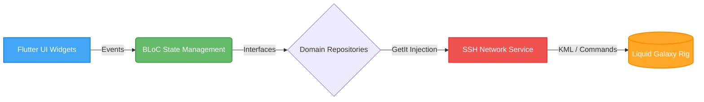

<div align="center">

# 🌌 Liquid Galaxy Agentic Starter Kit

**Build immersive, distributed 3D experiences without the boilerplate.**

[](https://flutter.dev/)
[](https://dart.dev/)
[](https://deepmind.google/technologies/gemini/)
[](#)

*A robust, Clean Architecture Flutter controller powered by an integrated AI Engineering Team.*

---
</div>

## 📖 Table of Contents
- [The Problem It Solves](#-the-problem-it-solves)
- [System Architecture](#-system-architecture)
- [The Agentic AI Team (Secret Weapon)](#-the-agentic-ai-team-secret-weapon)
- [Core Features](#-core-features)
- [Getting Started](#-getting-started)
- [Repository Structure](#-repository-structure)
- [About the Author](#-about-the-author)

---

## 🛑 The Problem It Solves

Developing for a multi-screen **Liquid Galaxy** rig is notoriously unforgiving. A single malformed KML string or a blocking SSH command on the main thread can cause frame drops, network desyncs, or completely freeze the physical rig.

**The Liquid Galaxy Agentic Starter Kit** eliminates this friction. It provides a heavily fortified, enterprise-grade Flutter architecture that abstracts away the complex hardware protocols. It allows you to focus 100% of your energy on designing sweeping, dynamic global tours instead of fighting with SSH timeouts.

> **Our core philosophy:** Go slow, be steady, and never enter an unpredictable error state.


---

## 🏗 System Architecture 

The codebase strictly enforces **Clean Architecture** and the **Dependency Inversion Principle (S.O.L.I.D)**. 

* **Dumb Views:** The UI layers (`features/dashboard/presentation/pages`) know nothing about IP addresses or connections.
* **App-Authoritative State:** The BLoC is the single source of truth. The rig screens are simply "dumb terminals" reflecting the BLoC's state.



---

## 🤖 The Agentic AI Team (Secret Weapon)

This repository is not just a template; it comes with a **Virtual AI Engineering Team** living inside the `.agent/` folder. Powered by **Google Gemini**, this team consists of 10 specialized AI agents. You can use these `SKILL.md` files to guide you through a strict, 6-stage error-free development pipeline:

| Stage | Agent Name | Role in the Pipeline |
| :--- | :--- | :--- |
| 1️⃣ | **🏗️ lg-init** | Scaffolds out your new feature folders with zero boilerplate. |
| 2️⃣ | **💡 lg-brainstormer** | Helps design dynamic 3D ideas tailored for the panoramic rig. |
| 3️⃣ | **🗺️ lg-plan-writer** | Drafts a step-by-step markdown blueprint before any code is written. |
| 4️⃣ | **⚙️ lg-exec** | Executes the blueprint, writing the complex Dart code step-by-step. |
| 5️⃣ | **🧐 lg-code-reviewer** | Audits your code for memory leaks and UI freezes before deployment. |
| 6️⃣ | **🎙️ lg-quiz-master** | Quizzes you on your own code to ensure you actually learned the architecture! |

🚨 **The Emergency Brake (`lg-skeptical-mentor`):** If a developer attempts to skip steps or rush their code, this specialized agent will autonomously halt the workflow and administer a pop-quiz on Clean Architecture to protect the repository's integrity.

---

## ✨ Core Features

Out of the box, the Starter Kit fulfills all baseline Liquid Galaxy requirements:

* **🛡️ Bulletproof SSH Client:** Managed via `dartssh2` with graceful timeout and error handling.
* **📍 Dynamic KML Engine:** Offloads heavy XML string generation to background threads/isolates.
* **🧹 Rig State Management:** Built-in commands to instantly clear logos, wipe KMLs, and reset the view.
* **⚡ Hardware Control:** Directly reboot, relaunch, or power-off the LG cluster from the tablet UI.

---

## 🚀 Getting Started

### Prerequisites
* **Flutter SDK:** (3.19+)
* **Hardware:** A physical Liquid Galaxy rig OR a virtual machine setup (3, 5, or 7 screens).
* **Device:** A tablet or emulator.

### Quick Install
```bash
# 1. Clone the repository
git clone [https://github.com/shivharebhoomi07/Gemini_LGSK_Flutter.git](https://github.com/shivharebhoomi07/Gemini_LGSK_Flutter.git)

# 2. Enter the directory
cd Gemini_LGSK_Flutter

# 3. Fetch dependencies
flutter pub get

# 4. Run the controller app
flutter run
```

### Connection Guide
1. Launch the app on your tablet.
2. Open the **Connection Settings** dashboard.
3. Input your Rig's Master Node IP, Port (default: `22`), Username, and Password.
4. Tap **Connect** and begin your orbit!

---

## 📁 Repository Structure
```text
/
├── .agent/            # 🧠 The AI Virtual Engineering Team & strict rules
├── assets/            # 🎨 Local KMLs and Logos
├── docs/              # 📄 Architecture maps and feature blueprints
├── lib/
│   ├── core/          # ⚙️ Global Toolkit (SSH Service, App Constants, Utilities)
│   ├── features/      # 🚀 Isolated App Features (Connection, Dashboard, etc.)
│   └── main.dart      # 🏁 App Entry Point & GetIt Injection
└── pubspec.yaml       # 📦 Dependencies
```

---

## 👨‍💻 About the Author

Built by **Bhoomi Shivhare** *Submitted for the Gemini Summer of Code – Agentic Programming Contest*

> The skills-based agent structure was inspired by Mentor Vitor’s approach and thoughtfully adapted to support a disciplined, scalable Liquid Galaxy development workflow.


---
📄 Read The Agentic Manifesto here for a deep dive into the engineering philosophy and AI pipeline behind this kit:
https://docs.google.com/document/d/10OKvAGe2V7LmYyL6xw9tj7mdKEF6yk-BhgP5DD8Wn14/edit?usp=sharing
